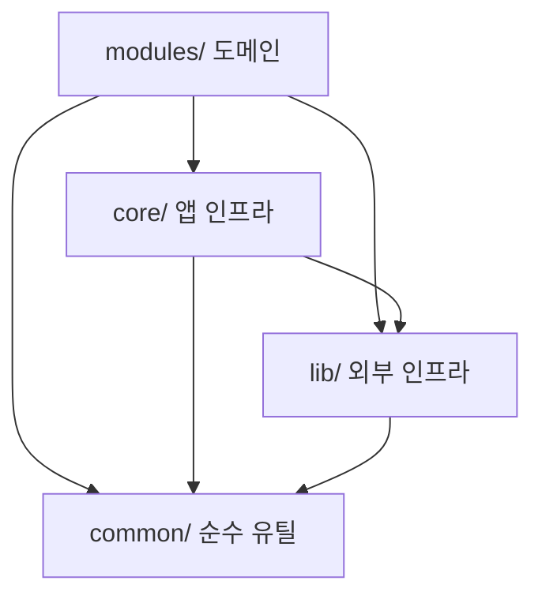
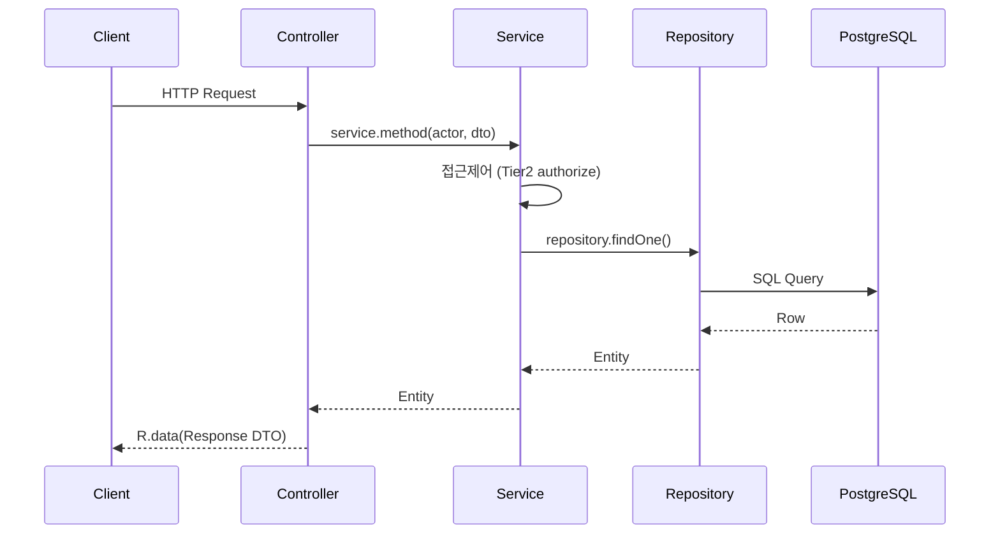

# Backend Template

도메인에 종속되지 않는 **NestJS 백엔드 스타터**. 인증·접근제어·설정·테스트·관측성·CI·컨벤션·AI 협업 환경(하네스)이
미리 깔린 상태에서 `src/modules/` 아래에 도메인만 얹으면 된다. `auth` + `identity`(User/Team/Role) 모듈이
**RBAC+ABAC 레퍼런스 구현**으로 들어 있어, 새 도메인은 이걸 본떠 만든다.

> 전체 정리본(상세 가이드): [Backend Template Guide (Notion)](https://app.notion.com/p/Backend-Template-Guide-38385e04e98280df8d31e6ccf9d1b28e)
> 단일 진실 출처는 항상 repo다 — 문서와 코드가 어긋나면 `docs/convention/`·`CLAUDE.md`를 따른다.

## 목차

1. [기술 스택](#기술-스택)
2. [핵심 설계 결정](#핵심-설계-결정-왜-이렇게)
3. [빠른 시작](#빠른-시작)
4. [프로젝트 구조 & 폴더 원칙](#프로젝트-구조--폴더-원칙)
5. [모듈 내부 구조](#모듈-내부-구조)
6. [아키텍처 핵심](#아키텍처-핵심)
7. [레퍼런스 모듈: auth + identity](#레퍼런스-모듈-auth--identity)
8. [개발 워크플로 (SDD)](#개발-워크플로-sdd)
9. [하네스 엔지니어링 (.claude/)](#하네스-엔지니어링-claude)
10. [운영 (CI/CD)](#운영-cicd)
11. [개발 스크립트](#개발-스크립트)
12. [문서](#문서)

---

## 기술 스택

| 항목            | 기술                  | 비고                                                                |
| --------------- | --------------------- | ------------------------------------------------------------------- |
| Runtime         | Node.js 24            | `package.json` engines                                              |
| Language        | TypeScript (strict)   |                                                                     |
| Framework       | NestJS 11             | SWC 빌드                                                            |
| ORM             | MikroORM v7           | Unit of Work, **legacy 데코레이터**(`@mikro-orm/decorators/legacy`) |
| DB / Cache      | PostgreSQL / Redis    | Redis는 graceful degradation(`safe` 메서드)                         |
| Auth            | JWT(HS256) + argon2id | AT 15m + RT 7d(rotation), httpOnly 쿠키, Redis blocklist            |
| Config          | zod typed config      | 부팅 시 env 검증                                                    |
| Package Manager | pnpm 10               | corepack                                                            |
| Test            | Jest 30 (`@swc/jest`) | unit / integration / e2e 3계층                                      |

### 핵심 설계 결정 (왜 이렇게)

- **도메인 비종속 + 레퍼런스 1개** — 엔진/골격을 제공하고, `identity`(auth+User/Team/Role)를 "정석 구현 예시"로 둔다. 새 도메인은 이걸 복제·변형한다.
- **타입 안전 설정** — 환경변수는 zod 스키마로 부팅 시 검증. 빈 문자열은 "누락"으로 취급. prod/stage는 약한 시크릿·디버그 노출을 부팅 거부.
- **default-deny 접근제어** — 역할(Role) capability RBAC + 소속팀 소유권 ABAC, 3-tier.
- **3경로 쿼리 전략** — 쓰기/단건은 MikroORM, 복잡 조회는 Kysely, 도메인 간 읽기는 ReadService.
- **기계 강제 컨벤션** — 레이어 경계·마이그레이션 드리프트·lint/format을 사람이 아니라 CI/훅이 막는다.
- **AI 협업 하네스** — "누가 작업해도 같은 품질"이 나오도록 시스템 프롬프트·스킬·서브에이전트·훅을 구조화.

---

## 빠른 시작

```bash
pnpm install          # 의존성 (corepack pnpm 10)
# .env 는 git에 없다(시크릿) — 팀에 값을 요청한다. (.env.test 는 committed, 로컬호스트 전용)
pnpm docker:up        # PostgreSQL + Redis (+ app)
pnpm start:dev        # 개발 서버 (watch + type-check + SWC, 기동 전 Swagger metadata 자동 생성)
```

- **API 문서**: `/api/docs` (Swagger UI) · `/api/docs/swagger.json` (orval 코드젠 입력)
- **헬스체크**: `/api/health-check` · `/api/health-check/full`(DB·Redis 검증)
- **테스트**: `pnpm test` (unit) · `pnpm test:integration` · `pnpm test:e2e` (docker 필요, `.env.test`)

> 처음 5분: `pnpm install` → `.env` 받기 → `pnpm docker:up` → `pnpm start:dev` → `/api/docs` → `pnpm test`

---

## 프로젝트 구조 & 폴더 원칙

```text
backend-template/
├── src/            애플리케이션 코드
├── tests/          3계층 테스트 (unit/integration/e2e + _utils)
├── docs/           컨벤션 / PRD / 기술부채 문서
├── scripts/        빌드·검증·자동화 스크립트
├── migrations/     DB 마이그레이션 (backend_template_migrations 테이블)
├── .claude/        AI 협업 하네스 (커맨드·에이전트·훅·설정)
└── .github/        CI 워크플로
```

### `src/` 레이어 — 의존 방향은 위→아래만

```text
src/
├── main.ts                  # 엔트리포인트 (require 순서: reflect-metadata → tracing → bootstrap)
├── bootstrap.ts             # Nest 앱 초기화 (전역 필터/파이프/CORS/helmet/throttle/shutdown)
├── app.module.ts            # 루트 모듈 (전역 가드/인터셉터 + 인프라·도메인 모듈 등록)
├── config/                  # zod 환경변수 스키마 + 네임스페이스 config
├── common/                  # DI 없이 import만으로 쓰는 순수 유틸 (도메인 모름)
│   ├── base/                #   BaseEntity, BaseRepository, 응답 래퍼 R.*
│   ├── config/              #   공통 설정 헬퍼
│   ├── constants/           #   전역 상수
│   ├── decorators/          #   @Public() 등 공통 데코레이터
│   ├── exceptions/          #   HTTP 예외 베이스 (exception 팩토리의 토대)
│   ├── types/               #   공용 타입
│   ├── utils/               #   쿠키·시간·마스킹 등 단일 유틸
│   └── validator/           #   공통 검증 로직
├── core/                    # 앱 전역 DI 인프라 (도메인 모름, lib만 의존 허용)
│   ├── auth/                #   전역 AuthGuard (Tier0 인증 + blocklist)
│   ├── cron/                #   크론 잡 추상 베이스
│   ├── filters/             #   전역 예외 필터 (통일 에러 포맷)
│   ├── interceptors/        #   요청 컨텍스트·통일 응답 인터셉터
│   ├── logger/              #   FrameworkLogger (console.* 금지)
│   └── tracing/             #   OpenTelemetry 트레이싱
├── lib/                     # 외부 시스템 연동 인프라
│   ├── access-control/      #   RBAC+ABAC 엔진 (가드/데코레이터/정책 베이스/평가기)
│   ├── database/            #   MikroORM 설정·네이밍 전략·시드·마이그레이션 러너
│   ├── redis/               #   Redis 클라이언트 (graceful degradation safe*)
│   ├── session/             #   세션 관리
│   ├── mail/                #   메일 발송 (기본 콘솔 드라이버)
│   └── storage/             #   파일 스토리지 (기본 noop 드라이버)
└── modules/                 # 비즈니스 도메인 — 새 도메인은 여기에
    ├── auth/                #   인증(토큰/세션) — Compact Feature 예시
    └── identity/            #   User/Team/Role — Role-Folder + RBAC+ABAC 레퍼런스
```

### 새 코드를 어디 둘지 (배치 기준)

1. DI 없이 import만으로 재사용 가능한 순수 유틸인가? → `common/`
2. 앱 전역에서 쓰는 가드·인터셉터·로거·필터·크론인가? → `core/`
3. DB·Redis·Mail·Storage·외부 시스템 연동인가? → `lib/`
4. 특정 비즈니스 유스케이스인가? → `modules/<domain>/`

### 의존성 방향



**폴더 배치 원칙** (상세: [01-project-structure](docs/convention/01-project-structure.md), [02-module-rules](docs/convention/02-module-rules.md)):

- **레이어 의존 방향**: `modules → lib → core → common`. 하위는 상위를 모른다. (유일 예외: `core → lib` 허용 — `AuthGuard`가 `lib/access-control` 사용.)
- 이 경계는 `pnpm dep:check`(dependency-cruiser)가 **CI에서 기계 강제**한다 (`no-circular`, `no-cross-module-internals`(타 도메인 entity/repository 직접 import 금지) 등).
- **도메인 우선 배치**: 기능 관련 파일은 레이어가 아니라 **도메인별로** 모은다. `modules/<domain>/` 안에서 역할별 폴더(`controller/service/repository/entity/dto/exception/enum/access`)로 나눈다(Role-Folder 패턴). 작은 모듈은 Compact(평면)도 허용 — 패턴 선택: [03-module-patterns](docs/convention/03-module-patterns.md).
- **bounded context = 1 모듈**: FK로 강결합된 엔티티(User/Team/Role)는 한 모듈(`identity`)에 둔다. 모듈 경계를 넘는 entity/repository 직접 import는 금지(dep:check 차단) → 동기는 imports/exports, 비동기는 이벤트.

### `tests/` 구조

```text
tests/
├── unit/**/*.spec.ts                      # 단위 (DB 불필요, pnpm test)
├── integration/**/*.integration.spec.ts   # 통합 (실제 DB, --runInBand)
├── e2e/**/*.e2e-spec.ts                    # E2E (앱 부팅/경량, 실제 파이프라인)
└── _utils/                                 # 테스트 하네스 (ORM 헬퍼, test-auth.guard, setup)
```

통합/e2e는 `backend_template_test` DB(`.env.test`, committed)에 연결. 상세·주의사항(jest 엔티티 명시 주입, fork-truncate 등): [08-testing](docs/convention/08-testing.md).

---

## 모듈 내부 구조

각 도메인 모듈(`modules/<domain>/`)은 규모에 따라 **Compact Feature** 또는 **Role-Folder** 패턴을 쓴다.
같은 역할 파일이 2개 이상이면 그 역할만 폴더로 승격한다. 패턴 선택 기준: [03-module-patterns](docs/convention/03-module-patterns.md).

### Compact Feature — 작은 도메인 (실제: `modules/auth/`)

```text
modules/auth/
├── auth.module.ts
├── auth.controller.ts
├── auth.service.ts
├── auth-cookie.service.ts      # 보조 서비스 (httpOnly 쿠키)
├── token.service.ts            # AT/RT 발급·검증
├── refresh-token.store.ts      # RT family rotation (Redis)
├── user-credential.port.ts     # DIP 포트 — identity가 어댑터로 구현
├── auth.constants.ts
├── dto/                        # Request/Response DTO
└── exception/                  # 도메인 예외 팩토리
```

### Role-Folder — 규모가 큰 도메인 (실제: `modules/identity/`)

```text
modules/identity/
├── identity.module.ts
├── controller/                 # HTTP 계층
├── service/                    # 비즈니스 로직 + 접근제어 Tier2 호출
├── repository/                 # 데이터 접근 계층
├── entity/                     # MikroORM 엔티티 (User/Team/Role)
├── dto/                        # Request/Response DTO
├── access/                     # Tier1 매트릭스 + Tier2 ResourcePolicy
├── enum/                       # enum, 상수
└── exception/                  # 도메인 예외 팩토리
```

### 레이어별 역할

| 레이어         | 역할                    | 포함 요소                                       |
| -------------- | ----------------------- | ----------------------------------------------- |
| **Controller** | HTTP 요청/응답 처리     | 라우팅, 인증/인가 데코레이터, DTO 바인딩        |
| **Service**    | 비즈니스 로직, 트랜잭션 | orchestration, 예외 처리, 이벤트 발행, 접근제어 |
| **Repository** | 데이터 영속화           | 조회, 필터, 페이지네이션, populate              |
| **Entity**     | 스키마 + 상태 변경      | 정적 팩토리(`create()`), 캡슐화된 수정 메서드   |

### 데이터 흐름



---

## 아키텍처 핵심

### 레이어 책임 (`Controller → Service → Repository → Entity`)

- **Controller**: 라우팅 + request binding만. 비즈니스 로직 없음. 응답은 `R.data`/`R.list`/`R.page`/`R.cursorPage`/`R.empty` envelope.
- **Service**: 유스케이스 진입점·orchestration·트랜잭션 경계 + **접근제어 Tier2 호출**.
- **Repository**: DB 조회/persistence만. 다른 도메인 repository 직접 주입 금지. 페이지네이션은 쿼리 시점 적용.
- **Entity**: `create()` 정적 팩토리 + 명시적 상태 변경 메서드로 캡슐화. 공통은 `BaseEntity`.
- **예외**: 인라인 `throw new HttpException/Error` 금지 → `exception/` 팩토리 상수.

상세: [04-layer-responsibility](docs/convention/04-layer-responsibility.md), [06-naming-and-style](docs/convention/06-naming-and-style.md).

### 접근제어 — RBAC + ABAC (default-deny, 3-tier)

| Tier       | 위치                                              | 질문                                                   | 실패 |
| ---------- | ------------------------------------------------- | ------------------------------------------------------ | ---- |
| **0 인증** | `AuthGuard`                                       | 토큰 유효 + 강제로그아웃 안 됨? (jti+blocklist)        | 401  |
| **1 RBAC** | `PolicyGuard` + `@Requires(action, resourceType)` | 이 주체의 **역할(Role)**이 이 리소스 타입에 이 액션을? | 403  |
| **2 ABAC** | `ResourcePolicy<TEntity>` (service)               | 이 리소스가 actor의 **소속팀** 것이고 권한 있나?       | 403  |

- 엔진은 `src/lib/access-control/`(도메인 비종속), **레퍼런스 구현은 `src/modules/identity/access/`**.
- **default-deny**: 보호 라우트는 `@Requires` 또는 `@Public()`이 **반드시** 있어야 한다. `SUPER`(globalRoles)는 전체 bypass.
- 두 "역할"을 구분: **Role**(capability, 매트릭스 키) vs **TeamPosition**(LEADER/MEMBER, 소유권 정제).
- ⚠️ 신뢰 경계: 토큰 발급자는 `teams`/`globalRoles`/`role`을 **DB 기준으로만** 채운다(클라 입력 신뢰 금지).

상세·보안 주의사항: [05-access-control](docs/convention/05-access-control.md).

### 관측성 & 전역 파이프라인

- **로깅**: `FrameworkLogger`(`console.` 금지) — `[caller:line][traceId]` 자동 prefix.
- **트레이싱**: OpenTelemetry(trace 전용). `OTEL_ENABLED=true`일 때 활성. traceId가 로그·응답 헤더(`x-trace-id`)에 동일하게 박혀 로그↔트레이스↔클라이언트가 한 id로 연결.
- **전역 인터셉터/필터**: 요청 컨텍스트 생성·전파, 통일 응답/에러 포맷(민감값 마스킹). 상세: [12-observability](docs/convention/12-observability.md).

### 3경로 쿼리 전략

도메인 내부 CRUD/단건 → **MikroORM** / 복잡 조회·집계 → **Kysely ReadModel**(커넥션 풀 재사용) / 도메인 간 읽기 → **ReadService**. 상세·인덱스 원칙: [10-query-strategy](docs/convention/10-query-strategy.md).

---

## 레퍼런스 모듈: `auth` + `identity`

새 도메인의 본보기. 실제 동작하는 RBAC+ABAC 인증 시스템이다.

### `modules/auth/` — 인증(토큰/세션)

- 로그인/refresh(rotation)/로그아웃. AT 15m HS256 + RT 7d(분리 시크릿, Redis family rotation + **재사용 탐지 → family 폐기**).
- httpOnly 쿠키 전달, 강제 로그아웃 blocklist(`blocked:{jti}`), 레이트리밋(login 5/분).
- **DIP**: `UserCredentialPort`를 정의하고 User 엔티티는 모른다 → identity가 어댑터로 구현(모듈 결합 회피).

### `modules/identity/` — User / Team / Role (한 bounded context)

| 개념     | 역할                                                                          |
| -------- | ----------------------------------------------------------------------------- |
| **Role** | capability 그룹(예: `RED`=관리, `BLUE`=읽기). Tier1 매트릭스 키. CRUD(SUPER). |
| **Team** | 소속팀(자원 소유 단위). Tier2 ABAC의 소유 기준. Role 1개에 속함.              |
| **User** | 소속팀 1개 + 직위(`TeamPosition`: LEADER/MEMBER) + `globalRoles`(SUPER 등).   |

- **Tier1 매트릭스**(`access/identity-access.matrix.ts`): `RED → user:manage`, `BLUE → user:read`. 키는 대문자 정규화.
- **Tier2 정책**(`access/user.resource-policy.ts`): READ=같은 팀 / CREATE=대상 팀 팀장 / UPDATE=팀장 또는 본인 / DELETE=팀장(본인 제외) / 직위 변경=팀장(본인 제외, self-escalation 차단).
- 목록은 소속팀으로 스코프, cross-team 단건 조회는 403(기본; 존재 민감 리소스는 404 마스킹 옵션).
- 테이블: `users`/`teams`/`roles` (예약어 회피 복수형), `email`/`name` **partial unique**(soft-delete 후 재사용 허용).

---

## 개발 워크플로 (SDD)

```text
PRD → /spec → /issues → /scaffold → 코딩 → /review → /test → /migration → /fe-changes → /commit
(사람) (인터뷰)(Linear) (뼈대)    (구현) (검증)  (테스트) (DB)        (FE공지)     (커밋)
```

`.claude/commands/`의 슬래시 커맨드로 PRD부터 커밋까지 추적이 끊기지 않게 흐른다. 핫픽스는 코딩부터, PR 전엔 `/review`→`/commit`만. 새 세션은 `/status`. → [하네스 구성](.claude/README.md)

### 마이그레이션

```text
로컬(dev): 엔티티 수정 → auto-sync (마이그레이션 파일 없이 빠르게 반복)
PR 전:     pnpm migration:create → SQL 검수 → pnpm migration:verify (임시 Docker DB dry-run)
배포:      pnpm migration:up (stage/prod, pending 있으면 부팅 거부)
```

- **드리프트 가드**(`scripts/check-entity-migration.mjs`): `*.entity.ts` 변경에 마이그레이션 누락 시 — pre-commit 경고, **CI 차단**.
- Idempotent SQL 필수(`IF NOT EXISTS` + 제약은 `pg_constraint` 가드). 상세·Baseline squash: [09-deployment](docs/convention/09-deployment.md).

---

## 하네스 엔지니어링 (`.claude/`)

AI(에이전트)가 팀원처럼 일하도록 모델을 감싸는 실행 환경. "누가 작업해도 같은 품질"이 목표다.

| 층              | 역할                        | 구현                                                                      |
| --------------- | --------------------------- | ------------------------------------------------------------------------- |
| 시스템 프롬프트 | 행동 규칙·DO/DON'T          | `CLAUDE.md` · `docs/convention/`                                          |
| 스킬            | `/명령`으로 반복작업 캡슐화 | `.claude/commands/` (SDD 파이프라인 + `/status`·`/mock-seed`)             |
| 서브에이전트    | 격리 컨텍스트 전문가        | `.claude/agents/` (`convention-reviewer`·`migration-reviewer`, 읽기 전용) |
| 훅              | 자동 실행/주입              | `.claude/hooks/` (SessionStart 컨텍스트 주입, PreToolUse 위험명령 차단)   |
| 가드레일        | 실수 차단                   | husky pre-commit(lint-staged + 드리프트) + CI                             |

상세: [.claude/README.md](.claude/README.md).

---

## 운영 (CI/CD)

**CI** (`.github/workflows/ci.yml`, PR→main, 하나라도 실패 시 차단):

```text
드리프트 체크 → install → lint:check → format:check → typecheck → dep:check → build
→ test(unit) → test:integration → test:e2e
```

**CD** (main 머지): `build → migrate → up → health check`. pending 마이그레이션이 있으면 stage/prod 부팅 거부.

| 환경              | APP_ENV        | DB 스키마                              |
| ----------------- | -------------- | -------------------------------------- |
| 로컬              | `dev`          | 엔티티 auto-sync                       |
| 스테이징/프로덕션 | `stage`/`prod` | migration guard + 시크릿 하드닝 게이트 |

> `**APP_ENV`를 모든 배포에 명시\*\*한다. 시크릿 하드닝(약한 `JWT_SECRET`/`REFRESH_TOKEN_SECRET`·`COOKIE_SECURE`·`RESPONSE_DEBUG_DETAIL`·`TRUST_PROXY`)은 prod/stage에서만 작동한다.

---

## 개발 스크립트

### 개발 서버 & 빌드

| 스크립트           | 설명                                                             |
| ------------------ | ---------------------------------------------------------------- |
| `pnpm start:dev`   | 개발 서버 (watch + type-check + SWC, 기동 전 metadata 자동 생성) |
| `pnpm start:debug` | 디버그 모드 개발 서버                                            |
| `pnpm start:prod`  | prod 런타임으로 `dist/main.js` 실행                              |
| `pnpm build`       | 프로덕션 빌드 (nest build + metadata SWC 컴파일)                 |
| `pnpm typecheck`   | 타입 체크 (`tsc --noEmit`)                                       |
| `pnpm metadata`    | Swagger 메타데이터(`src/metadata.ts`) 생성                       |

### 마이그레이션 & 데이터

| 스크립트                 | 설명                                    |
| ------------------------ | --------------------------------------- |
| `pnpm migration:create`  | 엔티티 변경 기준 마이그레이션 생성      |
| `pnpm migration:verify`  | 임시 Docker DB에서 마이그레이션 dry-run |
| `pnpm migration:up`      | 마이그레이션 실행                       |
| `pnpm migration:down`    | 마이그레이션 롤백                       |
| `pnpm migration:list`    | 적용된 마이그레이션 목록                |
| `pnpm migration:pending` | 미실행 마이그레이션 확인                |
| `pnpm migration:fresh`   | 전체 재실행 (로컬 초기화용)             |
| `pnpm seed`              | core 시드 실행                          |
| `pnpm mock:seed`         | faker mock 시드 (dev 전용)              |

### 코드 품질 & 테스트

| 스크립트                | 설명                                  |
| ----------------------- | ------------------------------------- |
| `pnpm lint`             | ESLint 검사 (자동 수정)               |
| `pnpm lint:check`       | ESLint 검사 (수정 없음, CI용)         |
| `pnpm format`           | Prettier 포맷팅                       |
| `pnpm format:check`     | Prettier 포맷 검사 (CI용)             |
| `pnpm dep:check`        | 레이어 경계 검사 (dependency-cruiser) |
| `pnpm test`             | 단위 테스트 (DB 불필요)               |
| `pnpm test:watch`       | 단위 테스트 watch 모드                |
| `pnpm test:cov`         | 테스트 커버리지 리포트                |
| `pnpm test:integration` | 통합 테스트 (실제 DB, 순차 실행)      |
| `pnpm test:e2e`         | E2E 테스트 (앱 부팅, 순차 실행)       |

### 로컬 인프라 (Docker)

| 스크립트               | 설명                            |
| ---------------------- | ------------------------------- |
| `pnpm docker:up`       | PostgreSQL + Redis (+ app) 시작 |
| `pnpm docker:up:build` | 이미지 재빌드 후 시작           |
| `pnpm docker:logs`     | app 로그 follow                 |
| `pnpm docker:down`     | 컨테이너 중지                   |
| `pnpm docker:clean`    | 컨테이너 + 볼륨(데이터) 정리    |

---

## 문서

| 문서                                          | 내용                                                   |
| --------------------------------------------- | ------------------------------------------------------ |
| [CLAUDE.md](CLAUDE.md)                        | 프로젝트 핵심 원칙(DO/DON'T) + 명령어                  |
| [docs/convention/](docs/convention/README.md) | 코딩 컨벤션 13종 (구조·레이어·접근제어·테스트·배포 등) |
| [docs/prd/](docs/prd/)                        | PRD/스펙 템플릿 (SDD 입력)                             |
| [docs/tech-debt/](docs/tech-debt/README.md)   | 의도적으로 미뤄둔 것 + 처리 트리거                     |
| [.claude/README.md](.claude/README.md)        | AI 협업 하네스 구성                                    |

## 명령어 (요약)

| 작업                   | 명령                                                            |
| ---------------------- | --------------------------------------------------------------- |
| 개발 / 빌드 / 타입체크 | `pnpm start:dev` · `pnpm build` · `pnpm typecheck`              |
| 린트 / 포맷 / 경계검사 | `pnpm lint` · `pnpm format` · `pnpm dep:check`                  |
| 테스트                 | `pnpm test` · `pnpm test:integration` · `pnpm test:e2e`         |
| 마이그레이션           | `pnpm migration:create` · `:verify` · `:up` · `:down` · `:list` |
| 시드 / 로컬 인프라     | `pnpm seed` · `pnpm mock:seed` · `pnpm docker:up` / `:down`     |

---

새 도메인을 추가할 때는 [docs/convention/README.md](docs/convention/README.md)부터 읽고, `modules/identity/`를 본보기로 삼는다.
